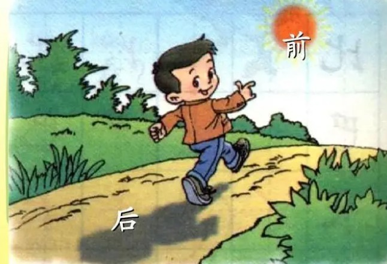

## 25. Shadow Mapping

### 认识影子

小学一年级，我们就了解了影子的知识。



有个好朋友，天天跟我走，有时走在前，有时走在后，我和它说话，它却不开口。

“前、后”都是表示方位的词，这两个词既说明了影子和我形影不离的关系，也说明了影子的位置是不断变化的。

光线总是沿着直线的方向向前，当被某种不透明的物体挡住时，光线就没办法穿透而停止，这时这个物体的后面就会形成一片阴影，这样就产生了影子。

所以影子的形成需要两个条件：有光和被不透明的物体挡住。

### 影子的物理描述

当光线照射到一个物体上时，一部分光线被吸收，一部分光线被反射。如果有其他物体在光线的路径上，那么这些物体就会挡住一部分光线，从而在它们的背后产生阴影。

阴影的大小和形状取决于光源的位置、物体的形状和大小以及其他物体的位置和形状。

在现实生活中，阴影是由太阳、灯光等光源产生的，可以用于判断物体的位置和形状，以及场景的深度和逼真度。

### 如何渲染影子？

目前我见过2种方式。

#### 1. 复制粘贴旋转法

对于2D游戏中的角色Sprite，复制一份，然后沿X轴旋转90°贴地，渲染为黑色，就实现了阴影的效果。

#### 2. 正儿八经法

阴影的产生，是因为靠近灯光的物体，遮挡住了光线，导致后面的物体，接受不到光线。

其实就是一个遮挡关系，只要能判断后面的物体，哪一些区域被前面的物体遮挡，就简单了，给这些被遮挡的区域，着色成黑色就是阴影了。

遮挡关系其实前面也提到过了，就是深度。

在 `24.2 FBO RenderTexture GameTurbo DLSS` 这一小节中，介绍了深度测试与深度缓冲区：

```text
和模板测试一样，GPU中有一个二维数组缓冲区，尺寸等于屏幕尺寸，每个像素对应数组的一个值，这个值就是当前像素记录的深度，这个二维数组缓冲区就是深度缓冲区。

垂直于屏幕的一条直线上，可能有多个片段。

OpenGL每处理一个片段，就把它的深度记录到深度缓冲区，当处理下一个片段的深度比这个大，那就抛弃这个片段，否则就更新深度值。

就是通过这个处理，实现了近处物体遮挡远处物体。
```

深度缓冲区这个二维数组，它就叫做深度图。

深度图只有一个通道，每个像素存储的是从相机到该片段的距离。

这个距离通常被称为深度值或Z值。

深度值通常被存储为浮点数，范围从0到1，其中0表示最近的像素，1表示最远的像素。

深度图中存储的数据，代表的是最终绘制出来的片段，也就是靠相机最前面的一个片段。

那我们从深度图中，就可以获取到片段是否被遮挡了。

但是，深度图是相机渲染后才有的，这样获取到的深度图，是站在相机的位置，去判断片段是否被遮挡的。

而我们需要的是从光源的位置去看。

所以，要在光源的位置，放一个相机，去渲染出一张深度图。

就这样，我们借助深度图，来实现阴影。


